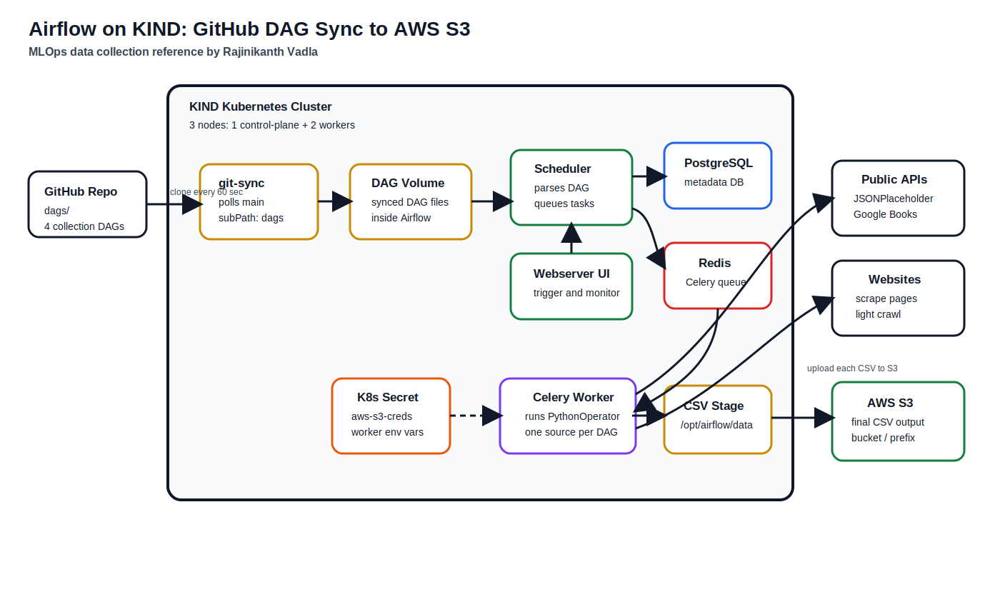

# Airflow 3.2 on KIND: Git-Sync DAGs + S3 Output

MLOps data collection lab by **Rajinikanth Vadla**.

## Architecture



## What This Lab Does

| Component | Detail |
|-----------|--------|
| **Cluster** | KIND 3-node cluster (1 control-plane, 2 workers) |
| **Airflow** | v3.2.0 with the **new React UI** |
| **DAG sync** | Helm `gitSync` pulls `dags/` from GitHub every 60 s |
| **Credentials** | AWS config stored as **Airflow Variables** (set via UI) |
| **Output** | CSV/JSON files uploaded to **AWS S3** |

## DAGs

| DAG ID | Source | S3 Folder |
|--------|--------|-----------|
| `api_user_collection_to_s3` | JSONPlaceholder Users API | `api-users/` |
| `scraping_collection_to_s3` | quotes.toscrape.com (BeautifulSoup) | `scraping/` |
| `crawling_collection_to_s3` | quotes.toscrape.com (multi-page crawl) | `crawling/` |
| `google_public_api_collection_to_s3` | Google Books API | `google-books/` |
| `test_api_user_collection_to_s3` | JSONPlaceholder Users API (JSON) | `test-users/` |

All DAGs: **collect data -> write local file -> upload to S3**.

## Data Flow

```
GitHub repo (dags/)
      |
      v  (git-sync every 60s)
KIND Cluster  -->  Airflow Scheduler  -->  Celery Worker
                                              |
                                    1. Collect data (API / Scrape / Crawl)
                                    2. Write CSV/JSON to /opt/airflow/data
                                    3. Read AWS creds from Airflow Variables
                                    4. Upload file to S3 bucket
```

## Prerequisites

- **Docker Desktop** running
- **kind** (`choco install kind` or [kind releases](https://kind.sigs.k8s.io/))
- **kubectl** (`choco install kubernetes-cli`)
- **Helm 3** (`choco install kubernetes-helm`)
- **AWS account** with S3 access (access key, secret key, bucket name)
- **GitHub** HTTPS URL to this repo (must be accessible from the cluster)

---

## Step-by-Step Setup

### 1. Create the KIND Cluster

```powershell
kind create cluster --name airflow-lab --config kind-config.yaml
```

Verify nodes:

```powershell
kubectl get nodes
```

### 2. Build and Load the Airflow Docker Image

```powershell
docker build -t airflow-lab:local .
kind load docker-image airflow-lab:local --name airflow-lab
```

### 3. Create Namespace and Add Helm Repo

```powershell
kubectl create namespace airflow
helm repo add apache-airflow https://airflow.apache.org/charts
helm repo update
```

### 4. Set Your GitHub Repo URL

Open `helm/airflow-values.yaml` and set the `repo` field under `dags.gitSync`:

```yaml
dags:
  gitSync:
    repo: https://github.com/YOUR_USER/airflow-labs-data-collection-quickstart.git
```

> **Private repo?** Create a GitHub PAT, then create a K8s secret and uncomment `credentialsSecret`:
>
> ```powershell
> kubectl create secret generic git-credentials -n airflow `
>   --from-literal=GITSYNC_USERNAME=your-github-username `
>   --from-literal=GITSYNC_PASSWORD=ghp_your_personal_access_token
> ```

### 5. Install Airflow via Helm

```powershell
helm upgrade --install airflow apache-airflow/airflow -n airflow `
  -f helm/airflow-values.yaml
```

### 6. Wait for All Pods to Start

```powershell
kubectl get pods -n airflow -w
```

Wait until all pods show `Running` (or `Completed` for jobs). This takes 3-5 minutes.

Expected pods:

```
airflow-api-server-xxx       Running
airflow-dag-processor-xxx    Running
airflow-scheduler-xxx        Running
airflow-worker-xxx           Running
airflow-triggerer-xxx        Running
airflow-redis-xxx            Running
airflow-postgresql-xxx       Running
```

### 7. Verify Git-Sync is Working

```powershell
$worker = kubectl get pod -n airflow -l component=worker -o jsonpath="{.items[0].metadata.name}"
kubectl exec -n airflow "$worker" -c git-sync -- ls /opt/airflow/dags/repo/dags/
```

You should see all DAG files listed.

### 8. Open the Airflow UI

```powershell
kubectl port-forward svc/airflow-api-server 8080:8080 -n airflow
```

Open in browser:

```
http://localhost:8080
```

Login credentials:

```
Username: admin
Password: admin
```

### 9. Set AWS Variables in the Airflow UI

Go to **Admin -> Variables** and add these 5 variables:

| Variable Key | Value | Required |
|-------------|-------|----------|
| `aws_access_key_id` | Your AWS access key | Yes |
| `aws_secret_access_key` | Your AWS secret key | Yes |
| `aws_default_region` | `us-east-1` (or your region) | Yes |
| `s3_bucket` | Your S3 bucket name | Yes |
| `s3_prefix` | `airflow-collected` | Optional |

**Option A - Add one by one** in the UI.

**Option B - Bulk import from JSON:**

1. Edit `variables_template.json` with your real values
2. In the UI, go to **Admin -> Variables -> Import Variables**
3. Upload the edited JSON file

### 10. Run the DAGs

1. In the UI, you will see 5 DAGs listed
2. **Unpause** each DAG by clicking the toggle
3. Click **Trigger DAG** on any DAG
4. Watch the run in the **Grid** or **Graph** view
5. Both tasks should turn **green** (success)

### 11. Verify Files in S3

```powershell
aws s3 ls s3://YOUR_BUCKET/airflow-collected/ --recursive
```

---

## Updating DAGs (Git-Sync Workflow)

1. Edit files under `dags/`
2. Commit and push to GitHub branch `main`
3. Wait 60 seconds for git-sync
4. Airflow automatically loads the updated DAGs
5. Trigger the DAG again

```powershell
git add dags/
git commit -m "update DAG logic"
git push origin main
```

---

## Troubleshooting

### DAGs not appearing in the UI

```powershell
# Check git-sync logs in the worker pod
$worker = kubectl get pod -n airflow -l component=worker -o jsonpath="{.items[0].metadata.name}"
kubectl logs -n airflow "$worker" -c git-sync --tail=30
```

### S3 upload failing

```powershell
$worker = kubectl get pod -n airflow -l component=worker -o jsonpath="{.items[0].metadata.name}"
kubectl logs -n airflow "$worker" -c worker --tail=30
```

### Check DAG import errors

```powershell
$dagproc = kubectl get pod -n airflow -l component=dag-processor -o jsonpath="{.items[0].metadata.name}"
kubectl logs -n airflow "$dagproc" -c dag-processor --tail=30
```

---

## Cleanup

```powershell
kind delete cluster --name airflow-lab
```

---

**Repository**: Rajinikanth Vadla - MLOps Data Collection Lab
