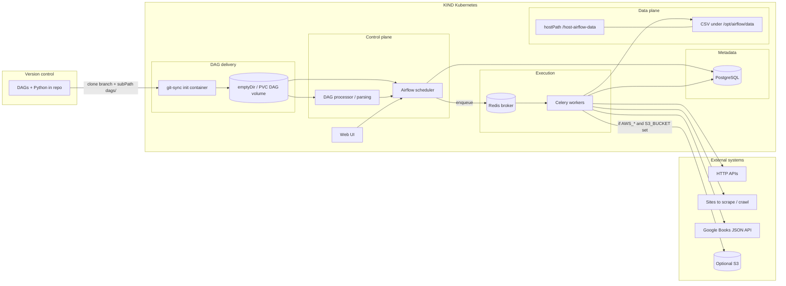

# Airflow on KIND: Git-synced DAGs, collection to CSV, optional S3



**Runtime path:** Git updates land in the DAG volume; the scheduler parses DAGs, places runs in metadata, Celery workers pull tasks, run operators, write CSVs to the mounted host directory (visible on the machine that hosts `./host-airflow-data`). Optional `boto3` upload runs only when credentials and bucket are present.

## Prerequisites

- Docker, [kind](https://kind.sigs.k8s.io/docs/user/quick-start/), [kubectl](https://kubernetes.io/docs/tasks/tools/), [Helm 3](https://helm.sh/docs/intro/install/)

## 1. Host folder (bind-mounted into nodes)

```powershell
New-Item -ItemType Directory -Force -Path .\host-airflow-data | Out-Null
```

## 2. Cluster

```powershell
kind create cluster --name airflow-lab --config kind-config.yaml
```

## 3. Custom Airflow image (Python deps for tasks)

```powershell
docker build -t airflow-lab:local .
kind load docker-image airflow-lab:local --name airflow-lab
```

## 4. Helm repo and install

```powershell
helm repo add apache-airflow https://airflow.apache.org/charts
helm repo update
kubectl create namespace airflow
```

Edit `helm/airflow-values.yaml`: set `dags.gitSync.repo` to the **HTTPS** URL of this repository (DAGs must already exist on `main` under `dags/`).

```powershell
helm upgrade --install airflow apache-airflow/airflow -n airflow -f helm/airflow-values.yaml --version 1.18.0
kubectl get pods -n airflow -w
```

## 5. UI

```powershell
kubectl port-forward svc/airflow-webserver 8080:8080 -n airflow
```

Open `http://localhost:8080` — `createUserJob.defaultUser` in `helm/airflow-values.yaml` defaults to `admin` / `admin` (change for anything beyond local use).

## 6. Trigger

Unpause `git_sync_data_collection` if needed; trigger a run. CSV files appear under `./host-airflow-data` on the workstation (same directory you used for `kind create`).

## Optional S3

Create a Secret, then attach it to **workers** (tasks run there) via `workers.extraEnvFrom` or `workers.extraEnv` with `valueFrom` in an override values file. Example Secret:

```powershell
kubectl create secret generic aws-s3-creds -n airflow `
  --from-literal=AWS_ACCESS_KEY_ID=YOUR_KEY `
  --from-literal=AWS_SECRET_ACCESS_KEY=YOUR_SECRET `
  --from-literal=AWS_DEFAULT_REGION=us-east-1 `
  --from-literal=S3_BUCKET=your-bucket
```

Reference: [extraEnv / extraEnvFrom](https://airflow.apache.org/docs/helm-chart/stable/adding-connections-and-variables.html). The DAG’s upload step no-ops until `AWS_ACCESS_KEY_ID`, `AWS_SECRET_ACCESS_KEY`, and `S3_BUCKET` are non-empty in the worker process. Optional: `AWS_ENDPOINT_URL` (S3-compatible endpoint), `S3_PREFIX` (defaults to `airflow-collected` in code).

Optional quota: set `GOOGLE_BOOKS_API_KEY` on workers if the Books API throttles unauthenticated calls.

## Cleanup

```powershell
kind delete cluster --name airflow-lab
```

---

Repository tag: **Rjnknth Vadla (Rajnikant Vardla)** — MLOps data collection reference.
