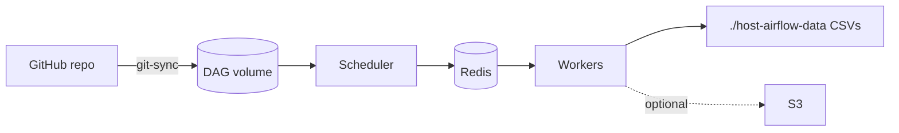

# Airflow on KIND — Git DAGs, CSV output, optional S3

**DAG updates from GitHub:** There is no extra “git sync file.” The Helm chart runs a **git-sync sidecar** when you set `dags.gitSync` in `helm/airflow-values.yaml`. It **polls your repo on a timer** and refreshes the `dags/` folder inside the cluster. Push to GitHub → next sync → scheduler picks up new DAG code.

`helm/workers-s3-secret.yaml` is **only** for optional AWS credentials (S3). Skip it if you do not use S3.

## How it works

1. **KIND** mounts `./host-airflow-data` on every node at `/host-airflow-data`.
2. **Helm** deploys Airflow; **git-sync** clones `branch` + `subPath: dags` from `dags.gitSync.repo` on an interval.
3. **Scheduler** parses DAGs from that volume; **Celery workers** run `PythonOperator` tasks.
4. Tasks write CSVs under `/opt/airflow/data` on workers → same path is **hostPath**, so files show up in `./host-airflow-data` on your machine.
5. **S3:** only if workers have `AWS_ACCESS_KEY_ID`, `AWS_SECRET_ACCESS_KEY`, `S3_BUCKET` (e.g. via Secret + `workers-s3-secret.yaml`).

## Prerequisites

Docker · [kind](https://kind.sigs.k8s.io/docs/user/quick-start/) · kubectl · [Helm 3](https://helm.sh/docs/intro/install/)

## Steps

| Step | Action |
|------|--------|
| **0** | Push this repo to GitHub (or any HTTPS Git). DAGs must live on branch `main` under folder `dags/`. |
| **1** | `New-Item -ItemType Directory -Force -Path .\host-airflow-data` |
| **2** | `kind create cluster --name airflow-lab --config kind-config.yaml` |
| **3** | `docker build -t airflow-lab:local .` then `kind load docker-image airflow-lab:local --name airflow-lab` |
| **4** | `helm repo add apache-airflow https://airflow.apache.org/charts` · `helm repo update` · `kubectl create namespace airflow` |
| **5** | In `helm/airflow-values.yaml`, set `dags.gitSync.repo` to your repo HTTPS URL (replace `YOUR_ORG/...`). |
| **6** | `helm upgrade --install airflow apache-airflow/airflow -n airflow -f helm/airflow-values.yaml --version 1.18.0` |
| **7** | Wait until pods are ready: `kubectl get pods -n airflow` |
| **8** | `kubectl port-forward svc/airflow-webserver 8080:8080 -n airflow` → open `http://localhost:8080` |
| **9** | Login: `admin` / `admin` (from `createUserJob.defaultUser` in the same values file). |
| **10** | Unpause DAG `git_sync_data_collection` if needed → **Trigger DAG**. |
| **11** | CSVs: `.\host-airflow-data\` (same folder as in step 1, relative to where you created the cluster). |

## Optional S3

1. `kubectl create secret generic aws-s3-creds -n airflow --from-literal=AWS_ACCESS_KEY_ID=... --from-literal=AWS_SECRET_ACCESS_KEY=... --from-literal=AWS_DEFAULT_REGION=us-east-1 --from-literal=S3_BUCKET=...`
2. Re-install with both files:  
   `helm upgrade --install airflow apache-airflow/airflow -n airflow -f helm/airflow-values.yaml -f helm/workers-s3-secret.yaml --version 1.18.0`

Without that second `-f`, the DAG still runs; the last task skips upload.

## Cleanup

`kind delete cluster --name airflow-lab`

---

Repository tag: **Rjnknth Vadla (Rajnikant Vardla)** — MLOps data collection reference.
